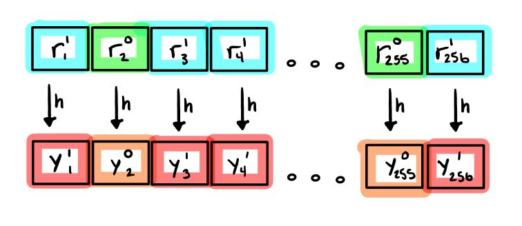

# Lamport algorithm example

In cryptography, a Lamport signature or Lamport one-time signature scheme is a method for constructing a digital signature.

The purpose is to show, How to implement Lamport on Rust?



## How to run project

* Make sure your local was installed Rust
* run command
```bash
cargo build
cargo run
```

## Requires
* rand = "0.8.4"
* hex = "0.4.3"
* sha2 = "0.10.0"

References Posts:

https://medium.com/asecuritysite-when-bob-met-alice/lamport-signatures-for-a-post-quantum-computing-world-279cb088570e

Thanks